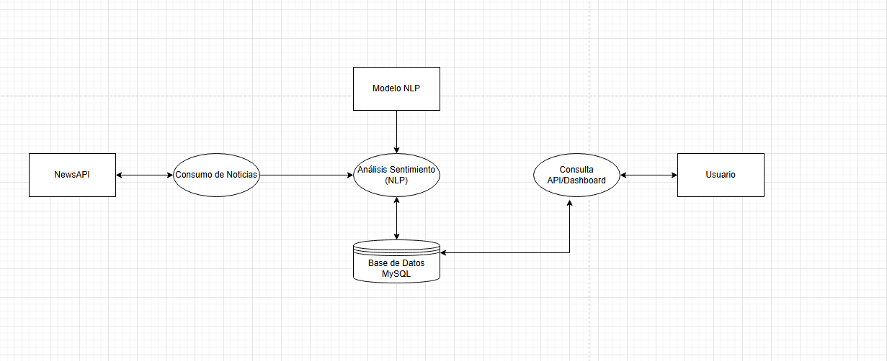

# Análisis de Sentimiento AI 📊🤖

Una aplicación web moderna que realiza análisis de sentimientos en tiempo real sobre títulos de noticias utilizando inteligencia artificial.

## 🚀 Características

- **Análisis en tiempo real**: Busca y analiza noticias de los últimos 7 días
- **IA avanzada**: Utiliza el modelo `groq/llama-3.3-70b-versatile` para análisis preciso
- **Interfaz intuitiva**: Chat interactivo desarrollado con Streamlit
- **Visualización de datos**: Gráficos de barras dinámicos con Plotly
- **Persistencia de datos**: Almacenamiento en base de datos MySQL
- **API robusta**: Backend desarrollado con FastAPI

## 🏗️ Arquitectura



### Flujo de datos:
1. **NewsAPI** → Obtiene noticias basadas en la consulta del usuario
2. **Consumo de Noticias** → Procesa y filtra los datos de noticias
3. **Modelo NLP** → Groq/Llama-3.3-70b-versatile analiza el sentimiento
4. **Análisis Sentimiento (NLP)** → Genera puntuaciones de 0-5
5. **Base de Datos MySQL** → Almacena resultados y históricos
6. **Consulta API/Dashboard** → Interfaz para visualizar datos
7. **Usuario** → Interactúa mediante chat de Streamlit

## 🛠️ Tecnologías Utilizadas

### Backend
- **FastAPI**: Framework web moderno y de alto rendimiento
- **CrewAI**: Orquestación de agentes de IA
- **LangChain + Groq**: Integración con modelos de lenguaje
- **MySQL**: Base de datos relacional
- **NewsAPI**: Fuente de noticias en tiempo real

### Frontend
- **Streamlit**: Interfaz de usuario interactiva
- **Plotly**: Visualizaciones de datos interactivas
- **Pandas**: Manipulación y análisis de datos

### Librerías Principales
```python
# IA y Procesamiento
crewai>=0.1.0
langchain-groq>=0.1.0
groq>=0.1.0

# Web Framework
fastapi>=0.104.0
streamlit>=1.28.0
uvicorn>=0.24.0

# Base de datos
sqlalchemy>=2.0.0
pymysql>=1.1.0

# Visualización
plotly>=5.17.0
pandas>=2.1.0

# Utilidades
requests>=2.31.0
python-dotenv>=1.0.0
```

## 📦 Instalación

### Prerrequisitos
- Python 3.9+
- MySQL Server
- Cuenta en NewsAPI
- API Key de Groq

### Pasos de instalación

1. **Clonar el repositorio**
```bash
git clone https://github.com/joaquin-papagianacopoulos/analisis_de_sentimiento_AI.git
cd analisis_de_sentimiento_AI
```

2. **Crear entorno virtual**
```bash
python -m venv venv
source venv/bin/activate  # Linux/Mac
# o
venv\Scripts\activate  # Windows
```

3. **Instalar dependencias**
```bash
pip install -r requirements.txt
```

4. **Configurar variables de entorno**
```bash
cp .env.example .env
```

Editar `.env` con tus credenciales:
```env
# API Keys
GROQ_API_KEY=tu_groq_api_key
NEWS_API_KEY=tu_news_api_key

# Base de datos
MYSQL_HOST=localhost
MYSQL_PORT=3306
MYSQL_DATABASE=sentiment_analysis
MYSQL_USER=tu_usuario
MYSQL_PASSWORD=tu_contraseña

# Configuración de la aplicación
DEBUG=True
MAX_NEWS_RESULTS=5
SEARCH_DAYS_BACK=7
```

5. **Configurar la base de datos**
```bash
python -c "from api.db import engine; from api.models import Base; Base.metadata.create_all(bind=engine)"
```

## 🚀 Uso

### Iniciar el backend (FastAPI)
```bash
uvicorn main:app --reload --host 0.0.0.0 --port 8000
```

### Iniciar el frontend (Streamlit)
```bash
streamlit run app.py
```

### Acceder a la aplicación
- **Frontend**: http://localhost:8501
- **API Docs**: http://localhost:8000/docs

## 💡 Cómo funciona

### Flujo de trabajo

1. **Entrada del usuario**: El usuario ingresa un título de noticia o palabra clave en el chat
2. **Búsqueda de noticias**: La aplicación consulta NewsAPI para obtener 5 noticias relacionadas de los últimos 7 días
3. **Análisis de sentimientos**: Cada titular se analiza usando el modelo Groq/Llama-3.3-70b-versatile
4. **Puntuación**: Se asigna una puntuación del 0 al 5:
   - **0-1.5**: Negativo 😞
   - **1.6-3.4**: Neutral 😐
   - **3.5-5**: Positivo 😊
5. **Almacenamiento**: Los resultados se guardan en la base de datos MySQL
6. **Visualización**: Se genera un gráfico de barras interactivo mostrando los sentimientos

### Ejemplo de uso

```python
# Entrada del usuario
query = "inteligencia artificial"

# Resultado esperado
{
    "query": "inteligencia artificial",
    "news_analyzed": 5,
    "average_sentiment": 4.2,
    "sentiment_distribution": {
        "positive": 3,
        "neutral": 2,
        "negative": 0
    },
    "timestamp": "2024-01-15T10:30:00Z"
}
```

## 📊 Estructura del Proyecto

```
analisis_de_sentimiento_AI/
├── api/
│   ├── __init__.py
│   ├── db.py              # Configuración de base de datos
│   ├── models.py          # Modelos SQLAlchemy
│   ├── main.py               # API FastAPI
│   ├── schema.py               # Modelo de datos
│   └── repository.py      # Operaciones de base de datos
├── sentiment_crew.py      # Lógica de CrewAI para análisis
├── app.py                # Aplicación Streamlit
├── requirements.txt      # Dependencias
├── .env                 # Variables de entorno  
├── .gitignore           # Archivos ignorados por Git
├── LICENSE               # Licencia del proyecto   
└── README.md            # Este archivo
```

## 🔧 Configuración Avanzada

### Personalizar el modelo de IA
```python
# En sentiment_crew.py
llm = ChatGroq(
    api_key=os.getenv("GROQ_API_KEY"),
    model="groq/llama-3.3-70b-versatile",
    temperature=0.1,  # Ajustar para más/menos creatividad
    max_tokens=500    # Limitar respuesta
)
```

### Configurar filtros de noticias
```python
# En main.py
news_params = {
    'apiKey': NEWS_API_KEY,
    'q': query,
    'language': 'es',  # Cambiar idioma
    'sortBy': 'publishedAt',
    'pageSize': 5,
    'from': from_date.isoformat()
}
```


## 🤝 Contribuir

1. Fork el proyecto
2. Crear una rama para tu feature (`git checkout -b feature/AmazingFeature`)
3. Commit tus cambios (`git commit -m 'Add some AmazingFeature'`)
4. Push a la rama (`git push origin feature/AmazingFeature`)
5. Abrir un Pull Request

## 📄 Licencia

Este proyecto está bajo la Licencia MIT. Ver `LICENSE` para más detalles.

## 👨‍💻 Autor

**Joaquín Papagianacopoulos**

- GitHub: [@joaquin-papagianacopoulos](https://github.com/joaquin-papagianacopoulos)
- LinkedIn: [Joaquin Papagianacopoulos](https://www.linkedin.com/in/joaquinpapagianacopoulos/)

**Lucas Bigiatti**
- GitHub: [@lucasbigiatti](https://github.com/lucasbigiatti)
- LinkedIn: [Lucas Bigiatti](https://www.linkedin.com/in/lucas-bigiatti-38431a300/)


---

⭐ ¡No olvides dar una estrella al proyecto si te resulta útil!
